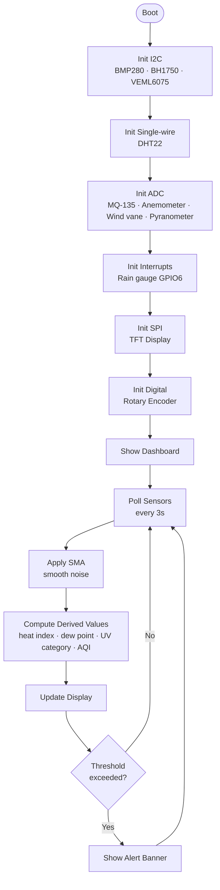

# 🌤️ Weather Station Firmware

A feature-rich embedded weather station built around a TFT display and rotary encoder, reading from a suite of environmental sensors with derived metrics, smoothing, and threshold alerts.

---

## 📡 Sensor Readings

The firmware runs a **periodic polling cycle** (every few seconds) collecting raw data from the following sensors:

| Parameter | Sensor |
| --- | --- |
| Temperature & Humidity | DHT22 / SHT31 |
| Wind Speed & Direction | Anemometer + Vane |
| Rainfall | Tipping Bucket Rain Gauge |
| UV Index | VEML6075 |
| Solar Radiation | Pyranometer |
| Luminosity | BH1750 |
| Atmospheric Pressure | BMP280 / BME280 |
| Air Quality | MQ-135 / SDS011 |


### Smoothing

A **simple moving average (SMA)** is applied to each raw reading before use. Wind speed and luminosity — which tend to spike sharply between samples — get a larger window to reduce noise.
> [!WARNING]
> Large SMA windows reduce noise but increase response lag. Tune carefully for fast-changing sensors like wind.
### Altitude

Altitude is **derived from atmospheric pressure** using the standard barometric formula. If the hardware includes a dedicated GPS or GNSS module, the firmware will use its altitude fix directly instead.
> [!WARNING]
> Barometric altitude accuracy degrades with weather changes. For precision use, prefer a GPS module.

---

## 🧮 Derived Values

Beyond raw sensor data, the firmware computes several higher-level metrics:

### Thermal Comfort
- **Heat Index / Wind Chill** — blends temperature, humidity, and wind speed to report how the weather actually *feels*
- **Dew Point** — computed from temperature and relative humidity

### UV Category

The raw UV index number is translated into a human-readable category:

| Index | Category |
| --- | --- |
| 0–2 | 🟢 Low |
| 3–5 | 🟡 Moderate |
| 6–7 | 🟠 High |
| 8–10 | 🔴 Very High |
| 11+ | 🟣 Extreme |

### Air Quality Category

Raw ppm / µg/m³ readings are mapped to a simple three-level label displayed on screen:

| Level | Label |
| --- | --- |
| Normal | 🟢 Good |
| Elevated | 🟡 Moderate |
| High | 🔴 Poor |

---

## 🖥️ Interface — TFT + Rotary Encoder

### Navigation

- **Rotate** the encoder to cycle between sensor screens
- **Press** the encoder to enter the detail view for the current screen, or to open settings

### Screens

| Screen | Content |
| --- | --- |
| 🏠 Dashboard | Summary of all readings at a glance |
| 🌡️ Temp / Humidity | Temperature, humidity, heat index, dew point |
| 💨 Wind | Speed, direction, gusts |
| 🌧️ Rain | Current rate, daily accumulation |
| ☀️ UV / Solar / Light | UV index + category, solar radiation, luminosity |
| 🔵 Pressure / Altitude | Atmospheric pressure, calculated altitude |
| 💨 Air Quality | AQI reading + category label |

### Detail View (encoder press)

Each screen has a detail view showing:
- **Daily history** — a mini chart or log of readings over the day
- **Min / Max** — lowest and highest recorded values since midnight

### Settings Menu

Accessible by long-pressing the encoder from the dashboard:

- 🕐 Set clock / timezone
- 🌡️ Unit toggle: **°C / °F**
- 💡 Display brightness

---

## 🚨 Alerts

The firmware monitors readings against configurable thresholds and shows **on-screen warnings** when limits are exceeded:

| Condition | Trigger |
| --- | --- |
| 🌧️ Rain detected | First tip registered by rain gauge |
| ☀️ UV very high | Index reaches "Very High" or above |
| 😷 Poor air quality | AQI crosses into "Poor" category |

Alerts are displayed as a banner overlay on whichever screen is active and persist until the condition clears.

---

## 🗂️ Project Structure

````
weather-station/
├── src/
│   ├── sensors/        # Per-sensor drivers and SMA logic
│   ├── derived/        # Heat index, dew point, UV category, AQI
│   ├── ui/             # TFT screen layouts and encoder handler
│   ├── alerts/         # Threshold definitions and alert dispatch
│   └── main.cpp        # Main loop and polling scheduler
├── include/
│   └── config.h        # Pin map, polling interval, thresholds
└── README.md
````

---

## PinMode

| GPIO | Function | Sensor / Peripheral | Bus | Notes |
| --- | --- | --- | --- | --- |
| 1 | ADC | MQ-135 (Air Quality) | ADC1_CH0 | |
| 2 | ADC | Anemometer (speed) | ADC1_CH1 | |
| 5 | ADC | Wind vane (direction) | ADC1_CH4 | Moved from GPIO3 (strapping pin) |
| 7 | ADC | Pyranometer (solar radiation) | ADC1_CH6 | Moved from GPIO5 |
| 4 | DATA | DHT22 (temp/humidity) | Single-wire | |
| 6 | INT | Rain gauge (tipping bucket) | Digital | Interrupt-capable |
| 8 | SDA | BMP280 / BH1750 / VEML6075 | I2C | |
| 9 | SCL | BMP280 / BH1750 / VEML6075 | I2C | |
| 11 | MOSI | TFT Display | SPI | |
| 13 | SCLK | TFT Display | SPI | |
| 10 | CS | TFT Display | SPI | |
| 12 | DC | TFT Display | SPI | |
| 14 | RST | TFT Display | SPI | |
| 15 | BL | TFT Backlight | PWM | |
| 16 | CLK | Rotary Encoder | Digital | |
| 17 | DT | Rotary Encoder | Digital | |
| 18 | SW | Rotary Encoder (button) | Digital | |

<details>
<summary>Flowchart view</summary>



</details>


## ⚙️ Configuration

Key parameters live in `include/config.h`:

```cpp
#define POLL_INTERVAL_MS     3000    // Sensor polling cycle (ms)
#define SMA_WINDOW_WIND      10      // Moving average window — wind
#define SMA_WINDOW_LUX       8       // Moving average window — luminosity
#define SMA_WINDOW_DEFAULT   5       // Moving average window — all others

#define ALERT_UV_THRESHOLD   8       // UV index — "Very High"
#define ALERT_AQI_THRESHOLD  150     // AQI — "Poor"
```
> [!CAUTION]
> Changing ALERT_AQI_THRESHOLD without understanding your sensor's output range may suppress real alerts.
---

## 📦 Dependencies

- [Adafruit GFX](https://github.com/adafruit/Adafruit-GFX-Library) — TFT graphics
- [Adafruit Sensor](https://github.com/adafruit/Adafruit_Sensor) — unified sensor API
- [DHT sensor library](https://github.com/adafruit/DHT-sensor-library) — temp/humidity
- [Adafruit BMP280](https://github.com/adafruit/Adafruit_BMP280_Library) — pressure/altitude
- [VEML6075](https://github.com/sparkfun/SparkFun_VEML6075_Arduino_Library) — UV index
- [BH1750](https://github.com/claws/BH1750) — luminosity
> [!IMPORTANT]
> Library versions are not pinned. If a dependency updates and breaks the build, lock versions in your package manager.

---

## 📄 License

MIT
